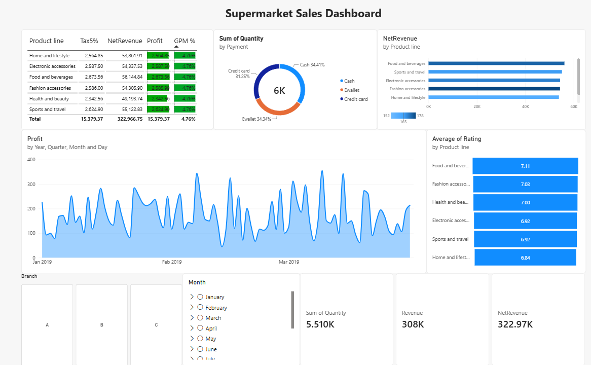
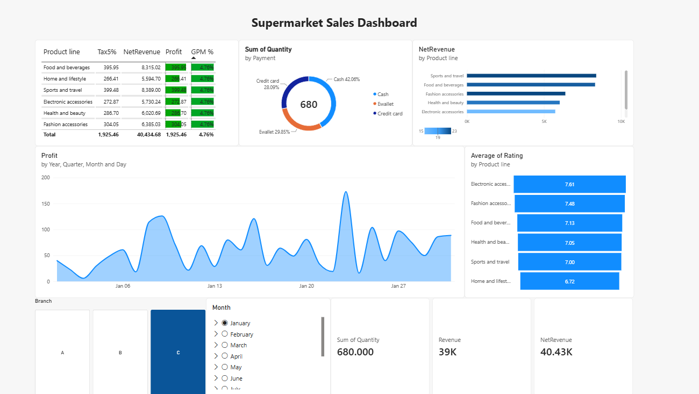

# 📊 Supermarket Sales Dashboard — Business Insight Report

> Laporan ini merangkum hasil visualisasi dashboard penjualan supermarket berbasis data transaksi periode **Januari – Maret 2019**, mencakup 3 cabang toko di Myanmar (Yangon, Mandalay, Naypyitaw). Tujuannya bukan cuma nampilin angka, tapi nyari cerita bisnis di baliknya — mana yang jalan bagus, mana yang perlu dibenerin.

---

## 1. Gambaran Umum Dashboard

Dashboard ini dibangun untuk menjawab pertanyaan dasar yang selalu ditanyain manajemen ritel: **"Toko kita untung berapa, dari mana asalnya, dan gimana trennya?"**. Dashboard dibuat dengan filter interaktif per cabang (A/B/C) dan per bulan, jadi bisa dilihat performa keseluruhan atau di-slice ke satu bulan tertentu.

Berikut tampilan dashboard secara keseluruhan (seluruh data Q1 2019):

Dan berikut tampilan saat di-filter khusus bulan **Januari** saja (cabang C dipilih):

---

## 2. Insight Utama (Overall — Q1 2019)

### 💰 Kesehatan Finansial Secara Umum
Total pendapatan bersih (**NetRevenue**) selama periode ini tembus **Rp 322,97 Juta** (dalam satuan data asli) dengan **Profit Rp 15,38 Juta** dan **Gross Profit Margin (GPM) yang sangat stabil di angka 4,76%** di semua lini produk. Ini poin penting: marginnya *flat* di semua kategori. Artinya struktur harga & markup diterapkan konsisten — bukan karena satu produk kebetulan lebih untung dari yang lain, tapi karena memang begitu kebijakan pricing-nya. Buat bisnis, ini bagus dari sisi *predictability*, tapi juga jadi sinyal: kalau mau naikin profit, cara realistisnya adalah dorong **volume penjualan**, bukan ngarep produk tertentu "ujug-ujug" lebih menguntungkan sendiri.

### 🏆 Produk Line Terbaik & Terlemah
Dari sisi revenue, urutannya cukup rapat, tapi **Food and Beverages** konsisten jadi penyumbang NetRevenue tertinggi (~Rp 56,1 Juta), diikuti **Sports and Travel** dan **Fashion Accessories**. Yang menarik, **Home and Lifestyle** justru NetRevenue-nya paling kecil (~Rp 53,9 Juta) meskipun secara jumlah kategori nggak beda jauh — mengindikasikan produk di kategori ini kemungkinan unit price atau volume terjualnya lebih rendah dibanding yang lain.

Tapi kalau dilihat dari sisi **rating pelanggan**, ceritanya berbeda lagi:
- **Food and Beverages** unggul di rating (7,11) *dan* revenue — kombinasi ideal, produk laku dan disukai.
- **Home and Lifestyle** justru rating-nya paling rendah (6,84) — dobel masalah: revenue kecil **dan** kepuasan pelanggan paling lemah. Ini kandidat kuat untuk dievaluasi ulang, entah dari kualitas produk, variasi SKU, atau strategi promosinya.

### 💳 Preferensi Pembayaran
Distribusi metode pembayaran cukup merata tapi condong ke **Ewallet (34,3%)**, disusul **Credit Card (31,3%)**, lalu **Cash (34,4%)**. Nggak ada satu metode yang dominan banget — artinya pelanggan di sini punya fleksibilitas pembayaran yang beragam, jadi toko *wajib* menjaga semua channel pembayaran ini tetap smooth. Kalau salah satu metode (misal EDC credit card) sering error, dampaknya ke ~31% transaksi bakal langsung kerasa.

### 📈 Pola Tren Profit Harian
Grafik *Profit by Year, Quarter, Month and Day* menunjukkan pola **zig-zag musiman mingguan** — profit naik-turun tajam tiap beberapa hari, bukan tren linear naik atau turun. Ini pola klasik ritel: kemungkinan besar terkait **pola belanja akhir pekan vs weekday**, atau bisa juga terkait siklus gajian/promo. Untuk tim operasional, ini insight actionable — staffing, stok, dan promo bisa disesuaikan mengikuti pola siklus ini, bukan asumsi permintaan rata setiap hari.

---

## 3. Insight Khusus — Slice Bulan Januari (Cabang C)

Saat dashboard difilter ke Januari dan cabang C, gambarannya jadi lebih granular:

- **NetRevenue Januari (cabang C): Rp 40,43 Juta**, dengan **Profit Rp 1,93 Juta** — GPM tetap konsisten di 4,76%, membuktikan margin memang stabil di level bulanan maupun cabang, bukan cuma rata-rata tahunan.
- **Sum of Quantity: 680 unit** terjual, dengan komposisi pembayaran yang sedikit berbeda dari data keseluruhan: **Cash memimpin di 42,06%**, disusul Ewallet 29,85% dan Credit Card 28,09%. Ini penting — di skala bulanan/cabang, preferensi pembayaran bisa bergeser cukup signifikan dari rata-rata global. Kalau tim hanya lihat data agregat tahunan, insight seperti ini bakal ketutup.
- Produk line terlaris tetap **Sports and Travel** dan **Food and Beverages** untuk NetRevenue di bulan ini, sementara rating tertinggi justru dipegang **Electronic Accessories (7,61)** — beda dengan pola keseluruhan yang dimenangkan Food and Beverages. Ini nunjukin preferensi pelanggan bisa fluktuatif per bulan, jadi rating produk sebaiknya dipantau berkala, bukan cuma sekali di akhir kuartal.
- Pola profit harian di Januari juga menunjukkan lonjakan tajam di sekitar tanggal **20-an** (mendekati Rp 175), jauh di atas hari-hari lain yang rata-rata di kisaran Rp 50–100. Ini kemungkinan hari dengan transaksi besar tunggal (big basket) atau efek event/promo tertentu yang layak ditelusuri lebih lanjut.

---

## 4. Rangkuman Rekomendasi Bisnis

| Area | Temuan | Rekomendasi |
|---|---|---|
| Margin Produk | GPM flat 4,76% di semua lini | Fokus strategi ke **volume**, bukan margin per-produk |
| Home & Lifestyle | Revenue & rating sama-sama terendah | Audit kualitas produk/SKU, evaluasi promosi khusus |
| Metode Pembayaran | Distribusi merata, sedikit beda per cabang/bulan | Pastikan semua channel (Cash, Ewallet, Kartu) selalu reliable |
| Tren Profit Harian | Pola zig-zag mingguan | Sesuaikan stok & staffing mengikuti siklus, bukan asumsi rata harian |
| Lonjakan Tgl 20-an (Jan) | Profit harian melonjak signifikan | Telusuri penyebab (promo/event) untuk direplikasi di bulan lain |

---

*Catatan: seluruh angka di atas diambil langsung dari hasil visualisasi dashboard yang di-generate dari dataset `supermarket_sales.xlsx` (periode Jan–Mar 2019, 1.000 transaksi, 3 cabang).*
